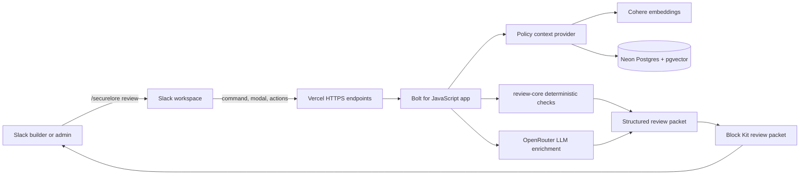
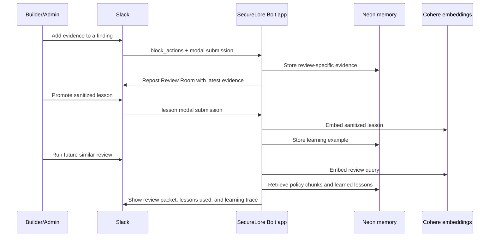
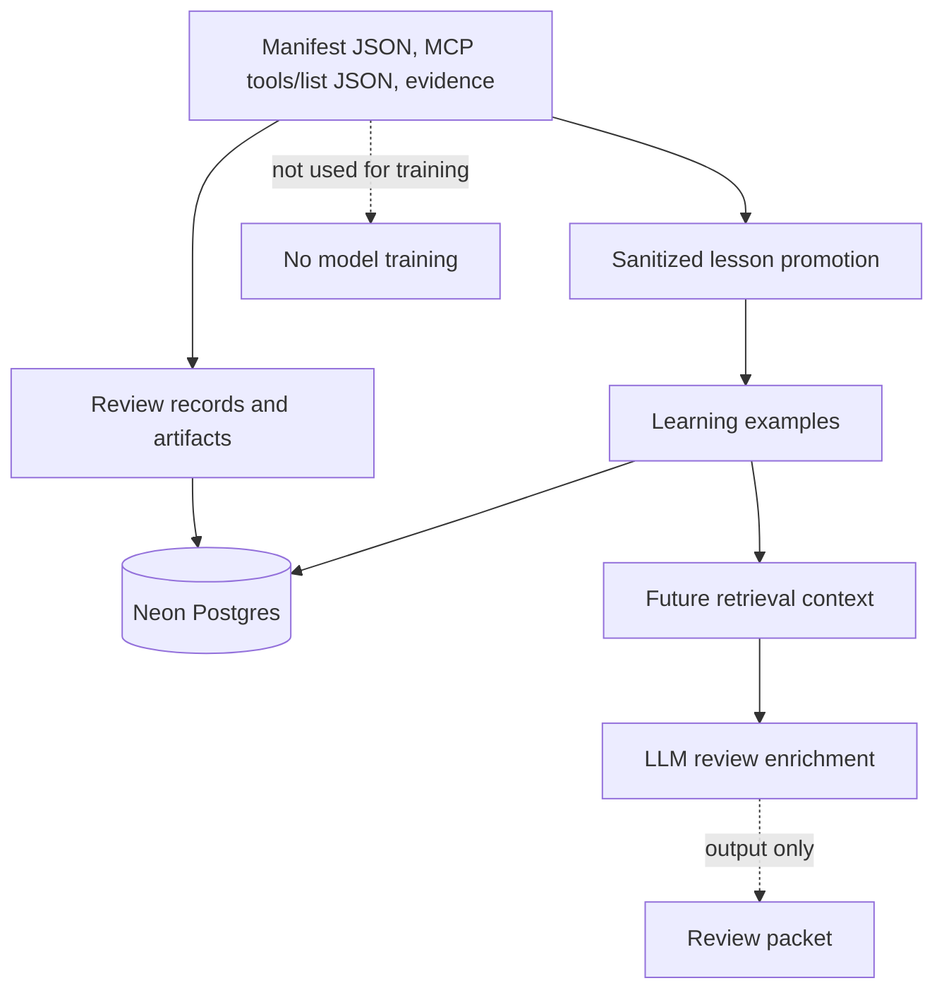
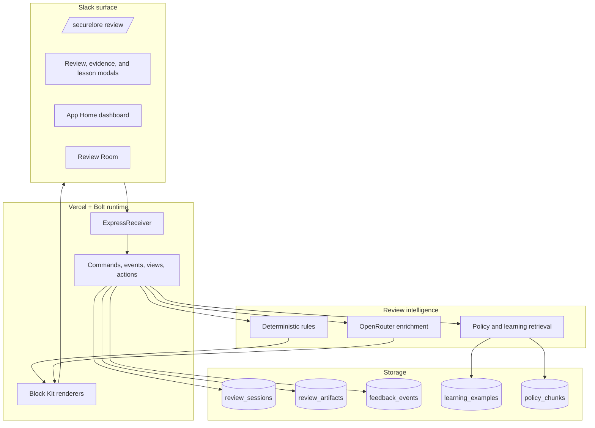

# SecureLore Architecture

SecureLore is a Slack-native review workflow for teams building Slack agents, MCP integrations, and Marketplace-ready apps. It turns app manifests, MCP tool metadata, and builder evidence into an admin-ready decision packet.

## System Flow

## Review Room And Learning Loop

## Data Boundaries

## Runtime Components

