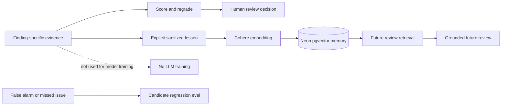
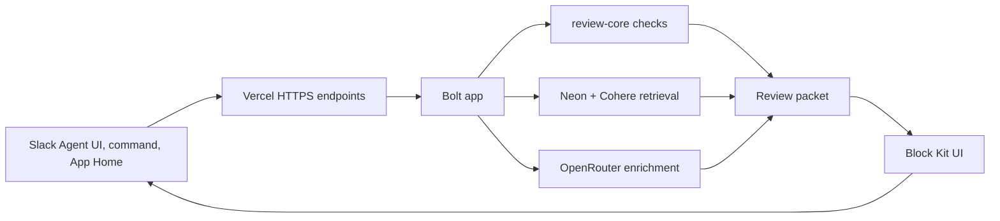
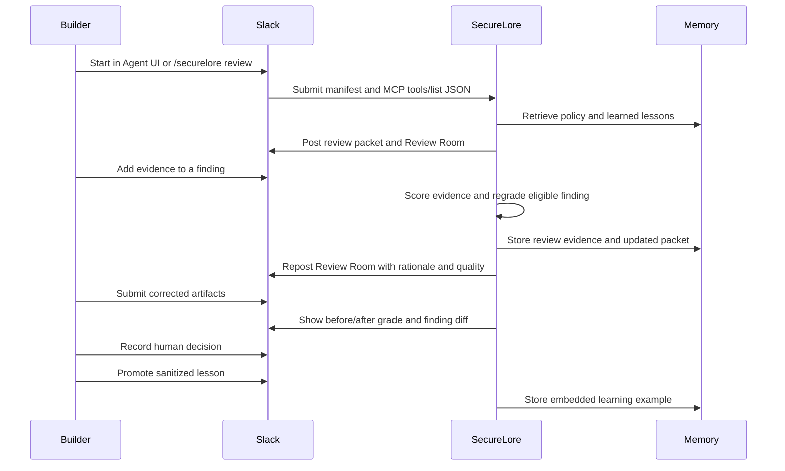

# SecureLore

SecureLore is a Slack-native preflight review system for teams building Slack agents, MCP integrations, and Marketplace-ready apps.

The business problem is the approval gap between a fast-moving builder and the workspace admin who must decide whether a Slack app is safe to install. Builders often have a manifest, a few scopes, an MCP tools list, and a demo. Admins need something different: clear risk, scope justification, data handling, AI disclosure, and evidence that the app behaves as claimed. SecureLore turns that gap into a structured Slack workflow.

## What SecureLore Does

SecureLore reviews real Slack app and MCP artifacts, then creates an admin-ready packet:

- Slack Agent/Assistant experience with native onboarding and thread status
- risk grade with blockers and warnings
- OAuth scope justification table
- MCP tool safety review
- Marketplace-style checklist
- safer manifest patch plan
- admin approval brief
- Review Room with finding-specific evidence quality scoring and regrading
- corrected-artifact lineage with resolved, remaining, and new findings
- auditable human decisions that cannot approve unresolved blockers
- tenant-scoped retrieval learning and candidate regression evals

The product is intentionally Slack-native. Builders run `/securelore review`, paste or upload artifacts, add evidence in Slack, promote sanitized lessons, and reopen reviews from App Home.

## Why It Matters

Slack agents can request sensitive scopes, expose AI behavior, connect MCP tools, and act inside workspaces. A generic chatbot answer is not enough for that workflow. SecureLore gives teams a repeatable review process that captures evidence, explains policy concerns, and improves over time without training a model on Slack data.

SecureLore learns through retrieval memory:



## Architecture



Detailed diagrams are in [ARCHITECTURE.md](ARCHITECTURE.md).

## Technical Stack

- Slack Bolt for commands, events, modals, App Home, and Block Kit actions
- Slack Agent/Assistant UI for the native AI agent experience required by the challenge
- Vercel for production HTTPS endpoints
- Next.js for public landing, privacy, and status pages
- TypeScript workspaces for Slack app, review core, memory, UI, and agent enrichment
- Neon Postgres with pgvector for review history, evidence, policies, and learning examples
- Cohere embeddings for policy and lesson retrieval
- OpenRouter for LLM-assisted review enrichment
- Executable regression benchmark for blocker recall, false positives, evidence guardrails, remediation, and human decisions

## Public Pages

SecureLore includes public pages required for a production-style Slack app review:

- `/` landing page
- `/privacy` privacy and AI/data disclosure
- `/status` human-readable service status
- `/api/health` deployment health check

## Slack Workflow



## Local Development

Use Node 24.

```bash
npm install
npm run build
npm run smoke:slack-form
npm run smoke:slack-artifacts
npm run smoke:slack-home
npm run eval:regression
```

## Production Endpoints

Production endpoints are deployed on Vercel:

- `/api/slack/commands`
- `/api/slack/events`
- `/api/slack/actions`
- `/api/health`

## Hackathon Track

Primary track: **New Slack Agent**.

SecureLore fits the challenge by building a Slack-native agent workflow that automates app review, surfaces policy-grounded insights, connects external memory and model systems, and creates artifacts that help teams make safer install decisions.

The required hackathon technology is the Slack Agent/Assistant experience. The review engine remains useful outside the Agent container, while Slack provides the primary onboarding, conversation, decision, and App Home surfaces.

## Quality Evidence

`npm run eval:regression` runs an 18-check controlled regression benchmark covering expected blocker recall, a corrected low-risk sample, MCP metadata, sensitive-scope evidence, evidence-resolution guardrails, review lineage, and human approval rules. The current controlled suite passes 18/18 with zero blocker false positives on the fixed sample. These figures describe the repository fixtures, not general-world accuracy.

## License

SecureLore is released under the [MIT License](LICENSE).
